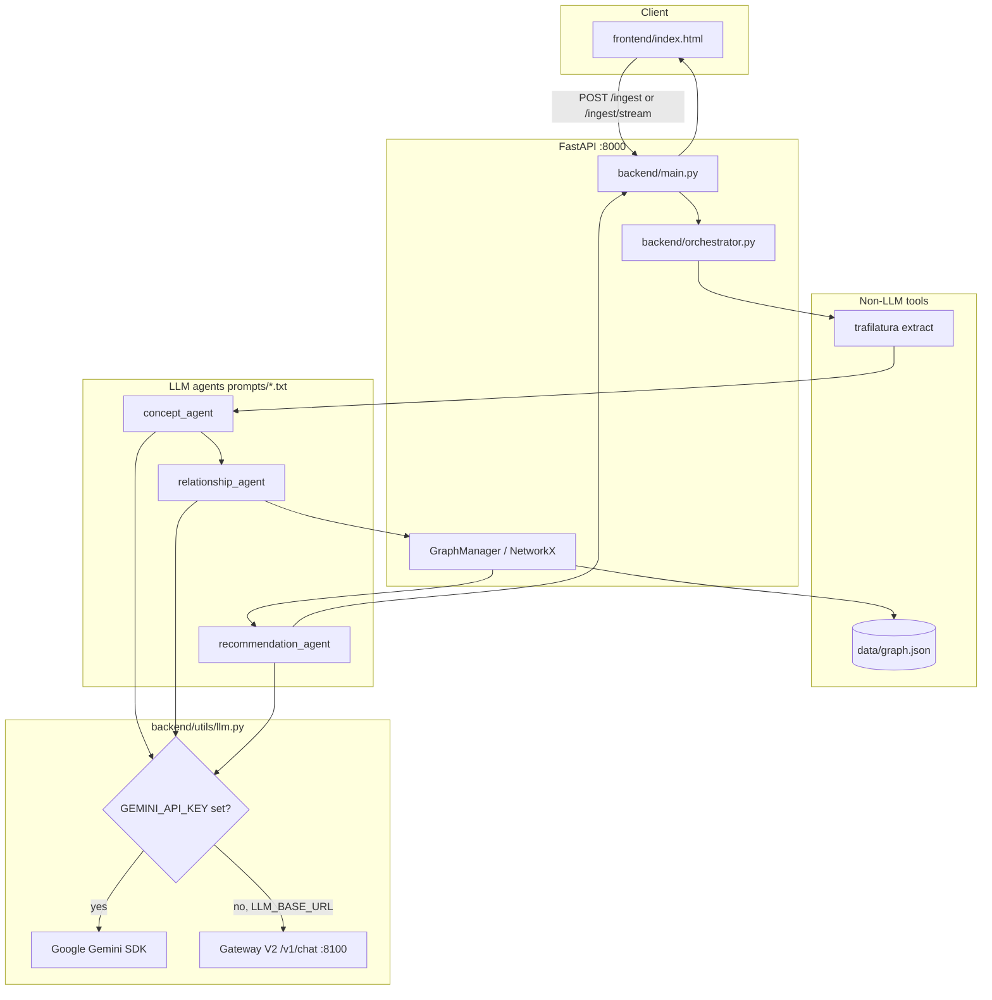
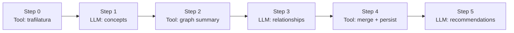
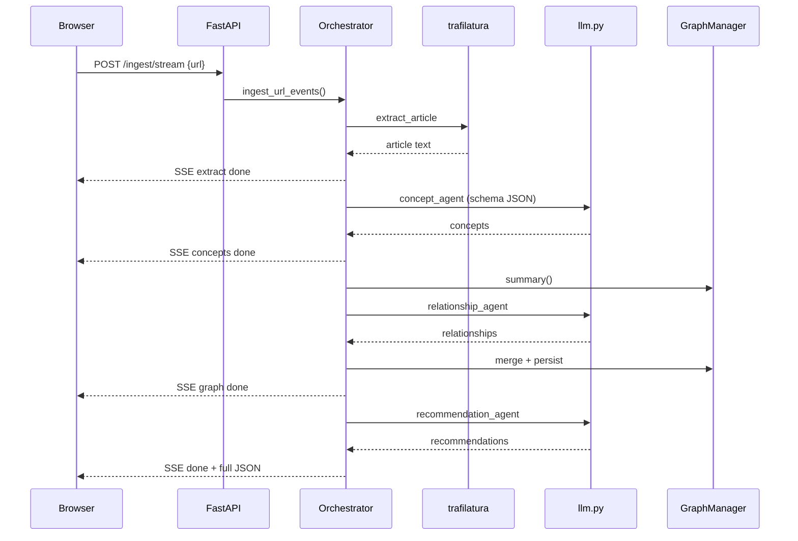
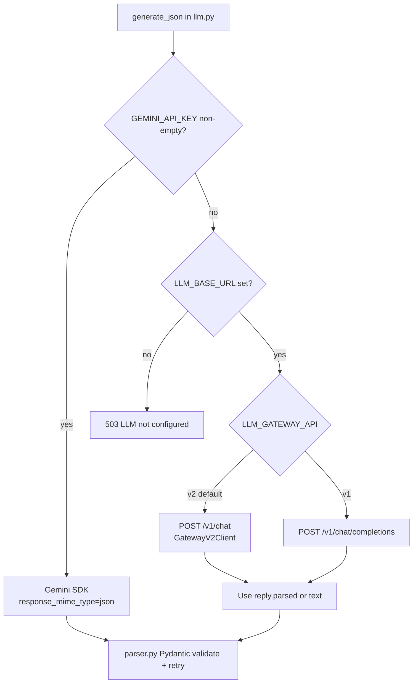
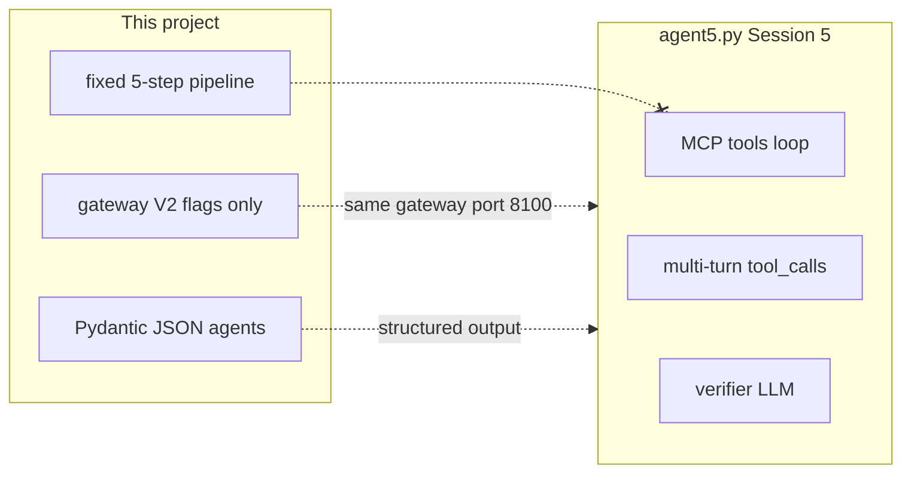

# System Design Knowledge Graph

An AI-powered evolving knowledge graph for system design learning. Ingest engineering blog URLs, extract concepts and relationships, persist an evolving graph in `data/graph.json`, and generate contextual learning recommendations.

---

## High-level architecture



---

## Ingest pipeline (5 steps)

Fixed orchestrator — same contract as [QUALIFIED_PROMPT.md](QUALIFIED_PROMPT.md). Not a free-form agent loop.



| Step | Type | Module / prompt |
|------|------|-----------------|
| 0 | Tool | `backend/extractor.py` — fetch URL, truncate ~8k chars |
| 1 | LLM | `prompts/concept_extraction.txt` → `ConceptExtractionResult` |
| 2 | Tool | `GraphManager.summary()` from `data/graph.json` |
| 3 | LLM | `prompts/relationship_reasoning.txt` → `RelationshipExtractionResult` |
| 4 | Tool | `GraphManager.merge_*` + `persist()` |
| 5 | LLM | `prompts/recommendations.txt` → `RecommendationResult` |



---

## LLM routing (Gemini vs Gateway V2)

Aligned with **Session 5 / `agent5.py`** when using the gateway: `cache_system`, `reasoning=off`, strict `response_format` JSON schema.



| Mode | Env | Health `llm_backend` | Endpoint |
|------|-----|----------------------|----------|
| Direct Gemini | `GEMINI_API_KEY=...` | `gemini` | Google API |
| Gateway V2 | `LLM_BASE_URL=http://127.0.0.1:8100` | `gateway-v2` | `/v1/chat` |
| Gateway V1 | `LLM_GATEWAY_API=v1` | `gateway-v1` | `/v1/chat/completions` |

**Priority:** If `GEMINI_API_KEY` is set, Gemini is used even when `LLM_BASE_URL` is set.

### vs `agent5.py` (what we adopted)



| `agent5.py` feature | This repo |
|---------------------|-----------|
| Gateway V2 `/v1/chat` | Yes (`backend/utils/gateway_v2.py`) |
| `cache_system`, `reasoning=off`, `response_format` | Yes (gateway path) |
| MCP + native `tool_calls` loop | No |
| `AgentTrace` / parallel TaskGroup | No (`PipelineTrace` timings only) |

---

## Project layout

```
system-design-knowledge-graph/
├── backend/
│   ├── main.py              # FastAPI routes
│   ├── orchestrator.py      # 5-step ingest pipeline
│   ├── extractor.py         # trafilatura
│   ├── graph_manager.py     # NetworkX + graph.json
│   ├── agents/              # concept, relationship, recommendation, detail
│   └── utils/
│       ├── llm.py           # Gemini + gateway V1/V2
│       ├── gateway_v2.py    # Thin client for llm_gatewayV2
│       └── parser.py        # JSON parse + Pydantic retry
├── prompts/                 # PHASE_1/2/3 agent prompts
├── frontend/index.html
├── data/graph.json          # persisted graph (committed sample data)
├── tests/
├── .env.example             # template (safe to commit)
└── .env                     # your keys (gitignored)
```

---

## Setup

### 1. App dependencies

```bash
cd system-design-knowledge-graph
cp .env.example .env
# Edit .env — add GEMINI_API_KEY and/or LLM_BASE_URL (see Environment)
uv sync
uv sync --extra dev
```

### 2. Environment variables

Copy [`.env.example`](.env.example) → `.env` and fill in real keys. **Never commit `.env`.**  
**Never put real API keys in `.env.example`** — only placeholders (that file is safe to commit).

Provider keys for **llm_gatewayV2** are usually stored in the parent `Assignment 5/.env`; the gateway reads `../.env` when started from `llm_gatewayV2/`. You may mirror the same keys in this project’s gitignored `.env` for convenience.

| Variable | Required | Description |
|----------|----------|-------------|
| `GEMINI_API_KEY` | Option A | Direct Gemini; if set, gateway is skipped |
| `GEMINI_MODEL` | No | Default `gemini-2.5-flash-lite` |
| `LLM_BASE_URL` | Option B/C | e.g. `http://127.0.0.1:8100` |
| `LLM_GATEWAY_API` | No | `v2` (default) or `v1` |
| `LLM_MODEL` | No | Model id sent to gateway |
| `LLM_PROVIDER` | No | Pin provider shortcut (`g`, `gr`, …) |
| `LLM_CACHE_SYSTEM` | No | `true` — cache system prompt (V2) |
| `LLM_REASONING` | No | `off` for pipeline LLM calls (V2) |
| `LLM_MAX_TOKENS` | No | Default `8192` |
| `LLM_API_KEY` | V1 only | Bearer for legacy completions API |

### 3. Optional — LLM Gateway V2 (port 8100)

Course material path (adjust to your machine):

```bash
cd "/path/to/Assignment 5/<course-id>/llm_gatewayV2"
./run.sh
curl -s http://127.0.0.1:8100/v1/capabilities | python3 -m json.tool
```

Provider API keys are usually in the **parent** `Assignment 5/.env` (gateway reads `../.env`).

**Use gateway from this app:**

```bash
# In system-design-knowledge-graph/.env
GEMINI_API_KEY=
LLM_BASE_URL=http://127.0.0.1:8100
LLM_GATEWAY_API=v2
```

---

## Run

**Terminal 1** (optional): gateway on 8100  
**Terminal 2**: app

```bash
uv run uvicorn backend.main:app --reload --host 0.0.0.0 --port 8000
```

- UI: http://127.0.0.1:8000/
- Health: http://127.0.0.1:8000/health

---

## API

| Method | Path | Description |
|--------|------|-------------|
| GET | `/health` | `llm_configured`, `llm_backend` (`gemini`, `gateway-v2`, …) |
| POST | `/ingest` | `{"url": "https://..."}` — full pipeline JSON |
| POST | `/ingest/stream` | Same pipeline as **Server-Sent Events** (live steps) |
| GET | `/graph` | Full graph snapshot |
| GET | `/graph/mermaid?focal=Kafka` | Mermaid subgraph around a concept |
| GET | `/graph/mermaid/full` | Entire graph as Mermaid |
| GET | `/graph/source?url=...` | Subgraph for one ingested article |
| GET | `/articles` | Ingested URL list |
| GET | `/concepts` | All concept names |
| GET | `/concepts/{name}` | Concept detail from graph |
| POST | `/concepts/{name}/enrich` | LLM-generated definition (`prompts/concept_detail.txt`) |

---

## Tests

```bash
uv run pytest tests/ -v
```

Smoke tests only (no live LLM). Gateway wiring: `tests/test_gateway_v2.py`.

---

## Prompt qualification

Specification: [QUALIFIED_PROMPT.md](QUALIFIED_PROMPT.md)

```json
{
  "explicit_reasoning": true,
  "structured_output": true,
  "tool_separation": true,
  "conversation_loop": true,
  "instructional_framing": true,
  "internal_self_checks": true,
  "reasoning_type_awareness": true,
  "fallbacks": true
}
```

---

## Example ingest response

```json
{
  "article": { "url": "...", "title": "...", "text": "..." },
  "concepts": {
    "reasoning": "...",
    "confidence": 0.85,
    "concepts": [{ "name": "Kafka", "category": "queue" }]
  },
  "relationships": {
    "relationships": [{ "source": "Partitions", "target": "Kafka", "relation_type": "part_of" }]
  },
  "recommendations": {
    "focal_concept": "Kafka",
    "prerequisites": ["Replication"],
    "learn_next": ["Consumer Groups"]
  },
  "graph_stats": { "node_count": 12, "edge_count": 15 },
  "mermaid": "graph LR\n  ..."
}
```

---

## Demo video

Ingest two engineering blog URLs; show graph growth and recommendations.

**YouTube link:** _(add your recording URL here)_

---

## Assignment coverage

- Multi-step agentic pipeline (3 LLM calls + deterministic tools)
- Pydantic validation with `reasoning`, `confidence`, `self_check`, `reasoning_types`
- Knowledge graph persistence (`data/graph.json`)
- Contextual recommendations (prerequisites, learn-next)
- Optional LLM Gateway V2 integration (Session 5 gateway features)
- Not a summarizer / stock / crypto tool

See also: [chat-gpt-reply.md](chat-gpt-reply.md)

---

## Security

- `.env` is **gitignored**; only commit `.env.example` with empty placeholders.
- If an API key was ever committed, **rotate it** in Google AI Studio / provider dashboards.
