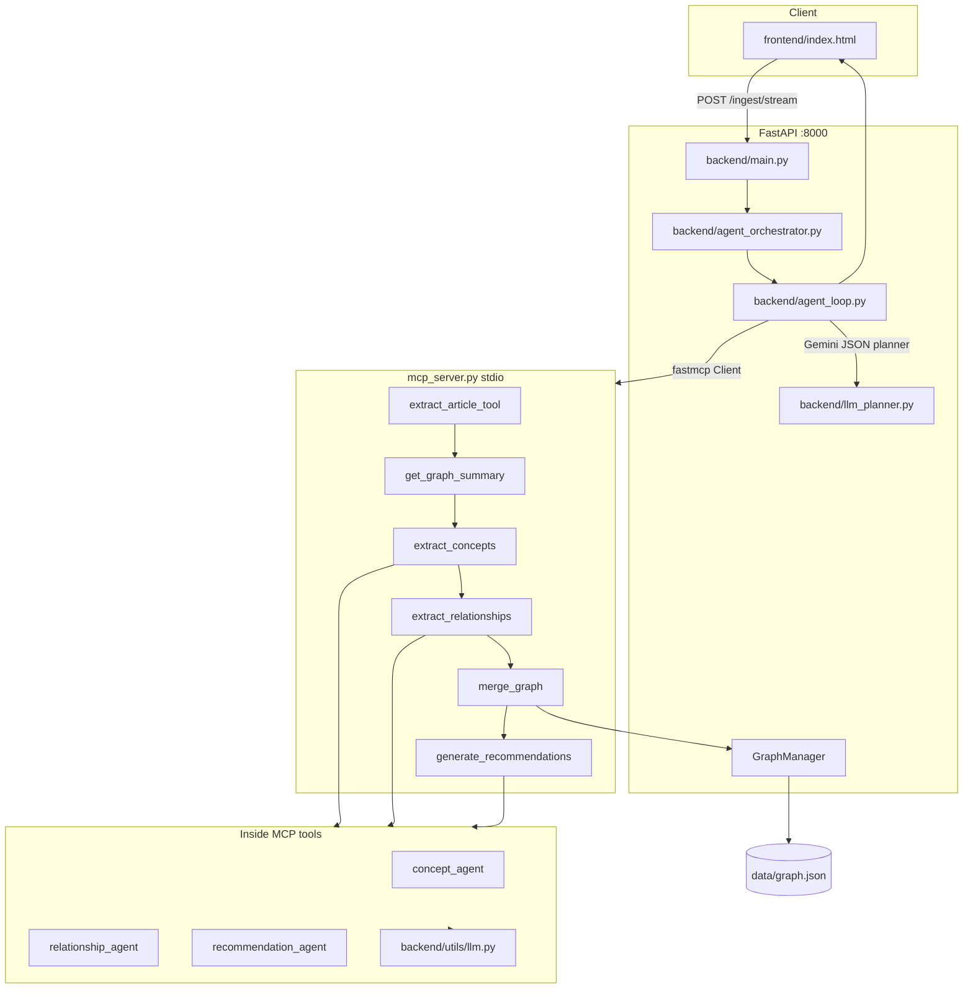

# System Design Knowledge Graph

An AI-powered evolving knowledge graph for system design learning. Ingest engineering blog URLs, extract concepts and relationships with LLM agents, persist an evolving graph in `data/graph.json`, and generate contextual learning recommendations.

**Stack:** FastAPI · NetworkX · trafilatura · [FastMCP](https://github.com/jlowin/fastmcp) · Gemini JSON planner · optional LLM Gateway V2

---

## Features

- **LLM orchestrator** — Gemini chooses MCP tools each turn (extract → concepts → relationships → merge → recommendations)
- **Live agent log** in the UI via Server-Sent Events (`POST /ingest/stream`)
- **Structured JSON agents** — Pydantic-validated concept, relationship, and recommendation outputs (`prompts/*.txt`)
- **Persistent graph** — NetworkX merged into `data/graph.json` with Mermaid visualization
- **Dual LLM routing** — Direct Gemini or course LLM Gateway V2 for inner agents inside MCP tools

---

## Architecture



### Ingest flow (agent mode)

1. **Planner** (`llm_planner.py`) — each turn returns JSON: `reasoning`, `tool_name`, `tool_args`, `done`
2. **MCP tools** (`mcp_server.py`) — run extract, LLM agents, graph merge, recommendations
3. **UI** — SSE `agent_log` events show every planner decision and tool result
4. **Complete** — `get_ingest_result` returns full `IngestResponse` + Mermaid

Typical tool order (planner is guided but may retry on errors):

`extract_article_tool` → `get_graph_summary` → `extract_concepts` → `extract_relationships` → `merge_graph` → `generate_recommendations` → `finish`

### Inner LLM agents (inside MCP tools)

| Agent | Prompt | Output schema |
|-------|--------|----------------|
| Concepts | `prompts/concept_extraction.txt` | `ConceptExtractionResult` |
| Relationships | `prompts/relationship_reasoning.txt` | `RelationshipExtractionResult` |
| Recommendations | `prompts/recommendations.txt` | `RecommendationResult` |

Routing in `backend/utils/llm.py`: **Gemini direct** if `GEMINI_API_KEY` is set, else **Gateway V2** if `LLM_BASE_URL` is set.

---

## Quick start

### Prerequisites

- Python **3.12+**
- [uv](https://docs.astral.sh/uv/) (recommended) or pip
- **Gemini API key** ([Google AI Studio](https://aistudio.google.com/apikey)) for the orchestrator planner

### 1. Clone and install

```bash
git clone <your-repo-url>
cd system-design-knowledge-graph
cp .env.example .env
# Edit .env locally only — never commit this file
uv sync --extra dev
```

### 2. Configure `.env`

Minimum for ingest:

```env
USE_AGENT_ORCHESTRATOR=true
GEMINI_API_KEY=          # paste your key here locally only
GEMINI_MODEL=gemini-2.5-flash-lite
LOG_LEVEL=INFO
```

Optional:

| Variable | Default | Description |
|----------|---------|-------------|
| `AGENT_MAX_TURNS` | `12` | Max planner ↔ tool turns |
| `AGENT_DEBUG` | off | Extra debug logs |
| `LOG_LEVEL` | `INFO` | `DEBUG` for verbose server logs |
| `LLM_BASE_URL` | — | Use gateway for inner agents instead of direct Gemini |
| `LLM_GATEWAY_API` | `v2` | `v2` or `v1` |
| `LLM_PROVIDER` | — | Pin gateway provider (`g`, `gr`, …) |

See [`.env.example`](.env.example) for gateway provider keys (Groq, NVIDIA, etc.).

### 3. Run

```bash
uv run uvicorn backend.main:app --reload --host 0.0.0.0 --port 8000
```

- **UI:** http://127.0.0.1:8000/
- **Health:** http://127.0.0.1:8000/health

Expected health when ready:

```json
{
  "llm_configured": true,
  "llm_backend": "gemini",
  "orchestrator_mode": "agent"
}
```

If `orchestrator_mode` is `"unavailable"`, set `GEMINI_API_KEY` and restart the server.

### 4. Ingest a blog URL

Open the UI, paste an engineering blog URL (e.g. a Shopify Engineering post), and watch the **LLM orchestrator log**. Or use the API:

```bash
curl -N -X POST http://127.0.0.1:8000/ingest/stream \
  -H "Content-Type: application/json" \
  -d '{"url": "https://shopify.engineering/shopify-data-guide-opportunity-sizing"}'
```

---

## Optional: LLM Gateway V2

Use the course **llm_gatewayV2** on port 8100 for inner agents (concepts / relationships / recommendations) while keeping the **Gemini planner** for orchestration:

```bash
# Terminal 1 — optional course gateway (path varies by install)
cd /path/to/llm_gatewayV2
./run.sh
```

```env
# Local .env only (gitignored)
LLM_BASE_URL=http://127.0.0.1:8100
LLM_GATEWAY_API=v2
LLM_MODEL=gemini-2.5-flash-lite
```

Keep provider keys in your **local** `.env` or the gateway’s parent `.env` — never in the repo.

---

## API

| Method | Path | Description |
|--------|------|-------------|
| GET | `/health` | `llm_configured`, `llm_backend`, `orchestrator_mode` (`agent` \| `unavailable`) |
| POST | `/ingest` | `{"url": "https://..."}` — blocking ingest JSON |
| POST | `/ingest/stream` | Same pipeline as **SSE** (live agent log + steps) |
| GET | `/graph` | Full graph snapshot |
| GET | `/graph/mermaid?focal=Kafka` | Mermaid subgraph around a concept |
| GET | `/graph/mermaid/full` | Entire graph as Mermaid |
| GET | `/graph/source?url=...` | Subgraph for one ingested article |
| GET | `/articles` | Ingested URL list |
| GET | `/concepts` | All concept names |
| GET | `/concepts/{name}` | Concept detail from graph |
| POST | `/concepts/{name}/enrich` | LLM definition (`prompts/concept_detail.txt`) |

---

## Project layout

```
system-design-knowledge-graph/
├── backend/
│   ├── main.py                 # FastAPI app
│   ├── orchestrator.py           # Ingest entry (agent mode)
│   ├── agent_loop.py             # Gemini planner + fastmcp client
│   ├── agent_orchestrator.py     # SSE events + UI agent log
│   ├── llm_planner.py            # Gemini JSON planner
│   ├── json_util.py              # MCP payload unwrap (fastmcp nested JSON)
│   ├── logging_setup.py          # LOG_LEVEL configuration
│   ├── extractor.py              # trafilatura
│   ├── graph_manager.py          # NetworkX + graph.json
│   └── agents/                   # concept, relationship, recommendation, detail
├── mcp_server.py                 # FastMCP tools (stdio subprocess)
├── prompts/                      # LLM agent prompts
├── frontend/index.html           # UI + agent log panel
├── data/graph.json               # persisted graph (sample data)
├── tests/
├── .env.example                  # safe template (commit this)
└── .env                          # your keys (gitignored)
```

---

## Tests

```bash
uv run pytest tests/ -v
```

| Test module | Covers |
|-------------|--------|
| `test_json_util.py` | FastMCP nested `result` JSON unwrap |
| `test_extractor.py` | trafilatura + UI message parsing |
| `test_agent_mode.py` | Orchestrator flags + MCP smoke |
| `test_gateway_v2.py` | Gateway client wiring |
| `test_imports.py` | Package imports |

CI runs the same suite on push/PR (see `.github/workflows/ci.yml`).

---

## Troubleshooting

| Symptom | Fix |
|---------|-----|
| `orchestrator_mode: unavailable` | Set `GEMINI_API_KEY` in `.env`, restart uvicorn |
| UI shows `0 chars` but logs show concepts | Fixed via `unwrap_mcp_payload` — pull latest and restart |
| `ModuleNotFoundError: fastmcp` | `uv sync` |
| Inner agents fail | Set `GEMINI_API_KEY` or start gateway + `LLM_BASE_URL` |
| Verbose debugging | `LOG_LEVEL=DEBUG` and `AGENT_DEBUG=true` |

Server logs go to the terminal running uvicorn (`stderr`).

---

## Prompt qualification

Specification: [QUALIFIED_PROMPT.md](QUALIFIED_PROMPT.md)

Aligned capabilities: explicit reasoning, structured Pydantic output, tool separation (MCP), multi-turn planner loop, instructional recommendations, self-checks on agents.

---

## Example ingest response

```json
{
  "article": { "url": "...", "title": "...", "text": "..." },
  "concepts": {
    "reasoning": "...",
    "confidence": 0.85,
    "concepts": [{ "name": "Kafka", "category": "queue" }]
  },
  "relationships": {
    "relationships": [{ "source": "Partitions", "target": "Kafka", "relation_type": "part_of" }]
  },
  "recommendations": {
    "focal_concept": "Kafka",
    "prerequisites": ["Replication"],
    "learn_next": ["Consumer Groups"]
  },
  "graph_stats": { "node_count": 130, "edge_count": 146 },
  "mermaid": "graph LR\n  ..."
}
```

---

## Demo video

Ingest two engineering blog URLs; show graph growth and recommendations.

**YouTube link:** _(add your recording URL here)_

---

## Assignment coverage

- Multi-step agentic pipeline (planner loop + 3 structured LLM agents in MCP tools)
- Pydantic validation with `reasoning`, `confidence`, `self_check`, `reasoning_types`
- Knowledge graph persistence (`data/graph.json`)
- Contextual recommendations (prerequisites, learn-next)
- Session 5 style: MCP tools + LLM orchestrator + optional Gateway V2
- Not a summarizer / stock / crypto tool

See also: [chat-gpt-reply.md](chat-gpt-reply.md) if present in your fork.

---

## Security

See **[SECURITY.md](SECURITY.md)** for a pre-push checklist.

- **Never commit** `.env` — only [`.env.example`](.env.example) with empty placeholders.
- Do not put real keys in README, issues, PRs, or CI logs.
- If an API key was ever committed, **rotate it** in Google AI Studio / provider dashboards.
- `.gitignore` excludes `.env`, virtualenvs, editor folders, and scratch files.

---

## License

MIT (or your course submission terms — add a `LICENSE` file if publishing publicly).
