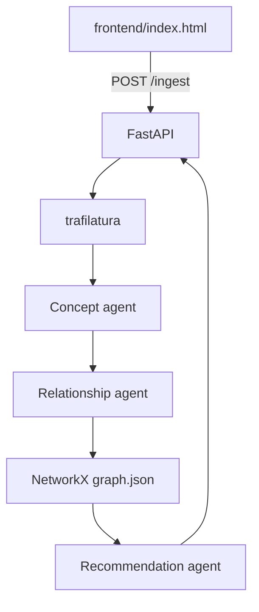

# System Design Knowledge Graph

An AI-powered evolving knowledge graph for system design learning. Ingest engineering blog URLs, extract concepts and relationships, persist an evolving graph, and generate contextual learning recommendations.

## Architecture



## Setup

```bash
cd system-design-knowledge-graph
cp .env.example .env
# Add GEMINI_API_KEY from Google AI Studio
uv sync
uv sync --extra dev
```

Optional LLM Gateway (port 8100): set `LLM_BASE_URL=http://127.0.0.1:8100` instead of or in addition to Gemini.

## Run

```bash
uv run uvicorn backend.main:app --reload --host 0.0.0.0 --port 8000
```

Open http://127.0.0.1:8000/ for the UI.

## API

| Method | Path | Description |
|--------|------|-------------|
| GET | `/health` | LLM configuration status |
| POST | `/ingest` | `{"url": "https://..."}` — full pipeline |
| GET | `/graph` | Current graph snapshot |
| GET | `/graph/mermaid?focal=Kafka` | Mermaid subgraph |

## Tests

```bash
uv run pytest tests/ -v
```

## Prompt qualification

Combined specification: [QUALIFIED_PROMPT.md](QUALIFIED_PROMPT.md)

Evaluator result (9-criteria rubric applied to agent prompts + orchestrator):

```json
{
  "explicit_reasoning": true,
  "structured_output": true,
  "tool_separation": true,
  "conversation_loop": true,
  "instructional_framing": true,
  "internal_self_checks": true,
  "reasoning_type_awareness": true,
  "fallbacks": true,
  "overall_clarity": "Prompts use phased reasoning (PHASE_1_INPUT, PHASE_2_REASON, PHASE_3_OUTPUT), required JSON schema, self_check and confidence fields, grounding rules, and partial/failed fallbacks."
}
```

## Example ingest response (structure)

```json
{
  "article": { "url": "...", "title": "...", "text": "..." },
  "concepts": {
    "reasoning": "...",
    "confidence": 0.85,
    "concepts": [{ "name": "Kafka", "category": "queue", ... }]
  },
  "relationships": { "relationships": [{ "source": "Partitions", "target": "Kafka", ... }] },
  "recommendations": {
    "focal_concept": "Kafka",
    "prerequisites": ["Replication"],
    "learn_next": ["Consumer Groups"]
  },
  "graph_stats": { "node_count": 12, "edge_count": 15 },
  "mermaid": "graph LR\n  ..."
}
```

## Demo video

Record a short walkthrough: ingest two engineering blog URLs, show graph growth and recommendations.

**YouTube link:** _(add your recording URL here)_

## Assignment coverage


- Multi-step agentic pipeline (3 LLM calls + tools)
- Pydantic validation with `reasoning`, `confidence`, `self_check`
- Knowledge graph persistence (`data/graph.json`)
- Contextual recommendations (prerequisites, learn-next)
- Not a summarizer / stock / crypto tool

chatgpt reply:
https://github.com/varunsood189/system-design-knowledge-graph/blob/main/chat-gpt-reply.md


